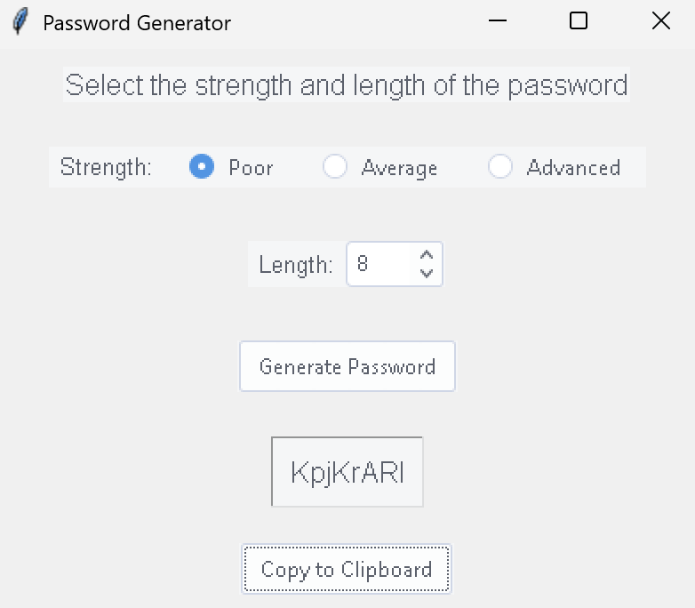

# SecurePass Generator 🔒

[](LICENSE)
[](https://www.python.org/downloads/)

A modern GUI password generator with customizable strength parameters and clipboard integration

 <!-- Add actual screenshot later -->

## Features ✨

- **Strength Customization**:
  - Poor (Letters + Numbers)
  - Average (+ Special Characters)
  - Advanced (+ Spaces)
- **Length Control** (8-64 characters)
- One-click clipboard integration
- Automatic dependency management
- Modern themeable GUI (ttkthemes)
- Cross-platform compatibility

## Installation 🛠️

```bash
# Clone repository
git clone https://github.com/yourusername/securepass-generator.git
cd securepass-generator

# Install requirements
pip install -r requirements.txt
```

## Usage 🚀

```bash
python main.py
```

**Interface Guide**:
1. Select password strength using radio buttons
2. Choose length with spinbox control
3. Generate passwords with single click
4. Copy directly to system clipboard

## Dependencies 📦

| Package | Version | Purpose |
|---------|---------|---------|
| `tkinter` | Built-in | GUI Framework |
| `ttkthemes` | 3.2.2 | Modern UI Styling |
| `random` | Built-in | Secure Entropy |
| `string` | Built-in | Character Sets |

Full list in [requirements.txt](requirements.txt)

## License 📜

This project is released under the [CC0 1.0 Universal](LICENSE) license:

```text
You are free to:
- Use commercially
- Modify and redistribute
- Use without attribution
- Patent and trademark use

No warranties provided. Use at your own risk.
```

## Contributions 🤝

We welcome community improvements:
1. Fork the repository
2. Create feature branch (`git checkout -b feature/improvement`)
3. Commit changes (`git commit -am 'Add new feature'`)
4. Push branch (`git push origin feature/improvement`)
5. Open Pull Request

---

**Security Note**: This tool uses Python's `random` module for demonstration purposes. For production security systems, consider using `secrets` module instead.
