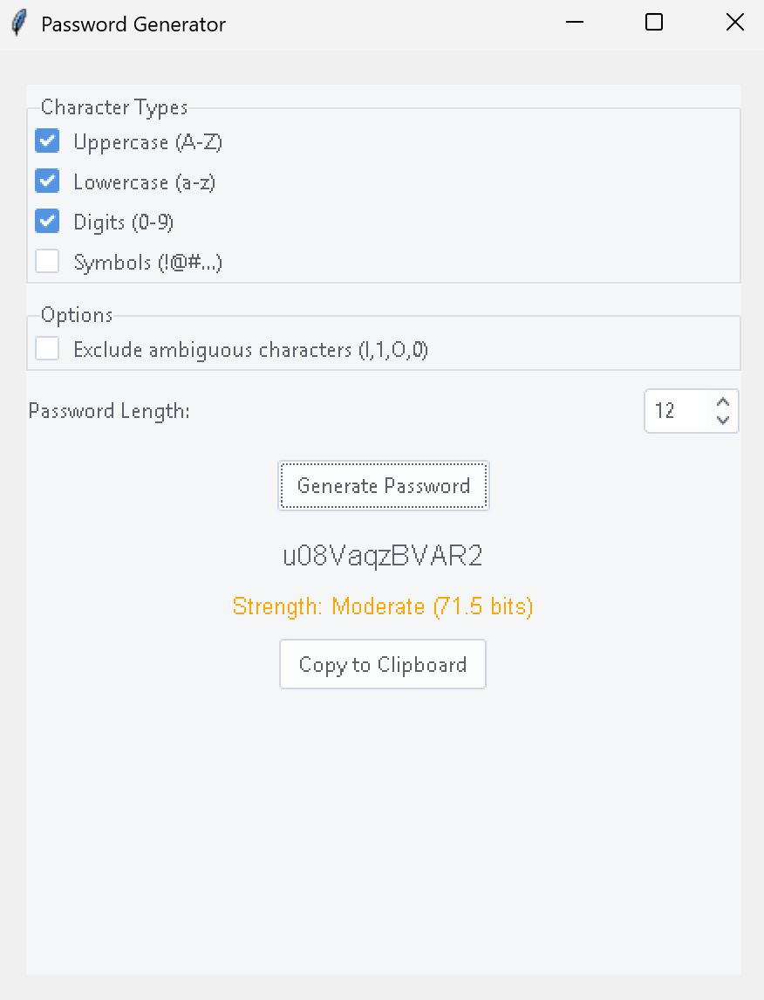

# SecurePass Generator 🔒

[](LICENSE)
[](https://www.python.org/downloads/)

Advanced GUI password generator with cryptographic security and entropy analysis



## Features ✨

- **Custom Character Sets**:
  - Uppercase/Lowercase letters
  - Digits
  - Special characters
  - Ambiguous character exclusion (l,1,O,0)
- **Security Features**:
  - Cryptographically secure generation (`secrets` module)
  - Real-time entropy calculation (bits)
  - Strength classification (Weak/Moderate/Strong)
- **Advanced Controls**:
  - Length selection (8-32 characters)
  - Input validation
  - Copy feedback animation
- Modern themeable GUI (ttkthemes)
- Automatic dependency management
- Cross-platform compatibility

## Installation 🛠️

```bash
# Clone repository
git clone https://github.com/yourusername/securepass-generator.git
cd securepass-generator

# Install requirements
pip install -r requirements.txt
```

## Usage 🚀

```bash
python main.py
```

**Interface Guide**:
1. Select character types using checkboxes
2. Enable/disable ambiguous characters
3. Choose password length (8-32)
4. Generate password with strength feedback
5. Copy to clipboard with visual confirmation

## Dependencies 📦

| Package     | Version  | Purpose                |
|-------------|----------|------------------------|
| `ttkthemes` | 3.2.2    | Modern UI Styling      |
| `tkinter`   | Built-in | GUI Framework          |
| `secrets`   | Built-in | Cryptographic Security |
| `math`      | Built-in | Entropy Calculation    |
Full list in [requirements.txt](requirements.txt)

## License 📜

This project is released under the [CC0 1.0 Universal](LICENSE) license:

```text
You are free to:
- Use commercially
- Modify and redistribute
- Use without attribution
- Patent and trademark use

No warranties provided. Use at your own risk.
```

## Contributions 🤝

We welcome community improvements:
1. Fork the repository
2. Create feature branch (`git checkout -b feature/improvement`)
3. Commit changes (`git commit -am 'Add new feature'`)
4. Push branch (`git push origin feature/improvement`)
5. Open Pull Request

---

**Security Implementation**: This tool uses Python's `secrets` module for cryptographically secure password generation. Entropy calculations follow NIST SP 800-63 recommendations for password strength estimation.